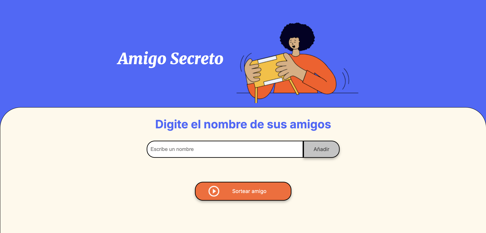
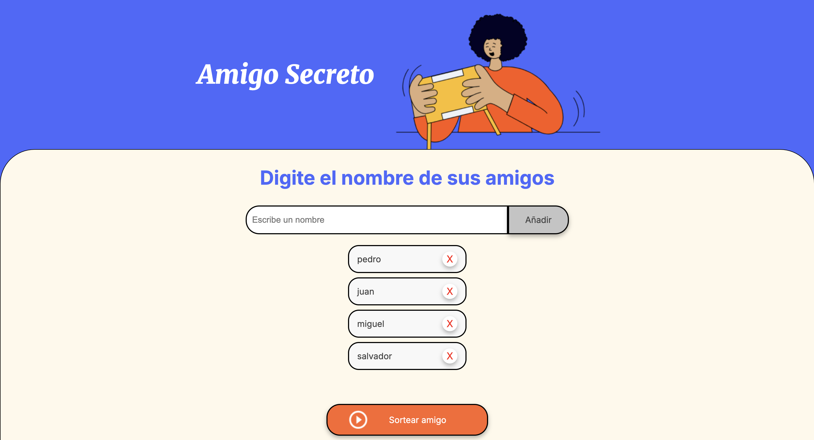

# Proyecto Amigo Secreto 🎁

Este es un proyecto simple de Amigo Secreto desarrollado con HTML, CSS y JavaScript puro. Permite a los usuarios agregar nombres a una lista, eliminarlos si es necesario y luego sortear aleatoriamente un amigo secreto.

# Características

    - Agregar nombres a una lista.

    - Eliminar nombres individualmente.

    - Sortear un amigo secreto de la lista.

    - Limpiar la lista automáticamente después del sorteo.

    - Diseño amigable e intuitivo.

# Estructura del Proyecto

    📁 secret-friend
    │── 📄 index.html    # Estructura principal del proyecto
    │── 📄 style.css     # Estilos del proyecto
    │── 📄 app.js        # Lógica del juego
    │── 📁 assets       # Imágenes y recursos

# Cómo Usarlo

    - Clonar este repositorio:

    - git clone https://github.com/salvagb1/secret-friend-game-JS.git

    - Abrir index.html en el navegador.

    - Ingresar nombres en el campo de entrada y presionar "Añadir".

    - Hacer clic en el botón "Sortear amigo" para elegir un amigo secreto al azar.

    - La lista de nombres se limpiará después del sorteo.

# Vista Previa

    - Escriba en el campo de texto el nombre que quiera añadir:

    - Cuando ya tenga una lista de nombres de click en el boton 'Sortear amigo' :

# Rama Demo
Existe una rama llamada demo en la cual hay otra versión del juego que utiliza recursividad y no repite nombres del listado.
Para acceder a ella, usa el siguiente comando:

    git clone https://github.com/salvagb1/secret-friend-game-JS.git -b demo